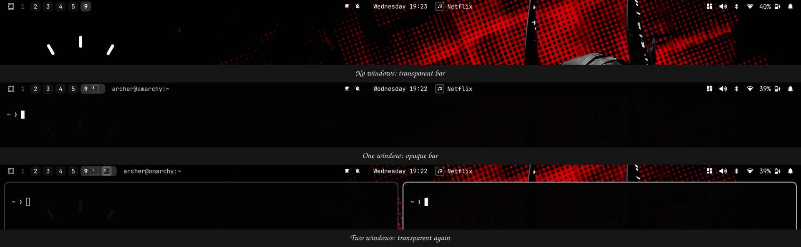

# Archer Bar

A personal fork of the stock Omarchy bar (`omarchy.bar`, cloned from Omarchy 4.0.2-1 with `omarchy plugin clone omarchy.bar`). Omarchy is MIT-licensed (David Heinemeier Hansson); the code here is that bar plus the changes below.



## What this fork changes

- **Loads as a custom bar.** A fresh clone of `omarchy.bar` doesn't load at all: the host assigns `omarchyPath`, `barWidgetRegistry` and `barConfig` after construction, but `Bar.qml` declares them `required property`, so the bar silently never appears. Those three are now ordinary properties with defaults. Full explanation and a re-apply command are in [`PATCHES.md`](PATCHES.md).
- **Automatic transparency by window count.** The bar is opaque only when the focused workspace has exactly one non-floating window, and clear otherwise.
- **Transparency actually fades.** The stock toggle snapped because the animation was attached to a property that wasn't the one being drawn. There is now a `Behavior on color` on the bar window (200 ms, in-out cubic).
- **No delay before the fade.** `transparent` used to flip only after `omarchy-bar-text-color` (about 0.5 s of pixel sampling) finished. It now flips immediately, and the sampled text colour fades in on its own.
- **Hover tooltips on the icons in the bar.** The tooltip text comes from the widgets (Wi-Fi, Bluetooth, battery and sound each have a forked plugin, `omarchy-archer-network`, `-bluetooth`, `-power` and `-audio`).

[`HANDOFF.md`](HANDOFF.md) has the working notes behind these changes and what's still open.

## Install

```bash
omarchy plugin add https://github.com/rk4500/omarchy-archer-bar.git --enable
omarchy bar use io.github.rk4500.archer-bar
omarchy restart shell
```

`omarchy bar reset` returns to the stock bar. The bar layout still lives under the `bar:` key of `~/.config/omarchy/shell.json`; this plugin only owns the rendering. Some edits (anything driving a `readonly property`, such as `barSize`) need `omarchy restart shell` rather than a hot reload.

This copy is not tracked by Omarchy's own update mechanism: changes to the stock bar don't arrive on their own and have to be merged in.

---

# Original Omarchy bar README

*Everything below is the stock README from `omarchy.bar`, unchanged. It describes the upstream plugin (including its `omarchy.bar` id); where it differs from the above, this fork's notes win.*

# Omarchy bar

This is the Quickshell implementation of the Omarchy status bar. It is
shipped as a first-party plugin of [`omarchy-shell`](../../README.md), the
long-running shell host. The bar is mounted at startup and lives inside
the shell for its whole session.

- `manifest.json` declares the plugin (`id: omarchy.bar`, `kind: bar`) and points at `Bar.qml` as the entry point.
- `Bar.qml` is Omarchy-owned bar engine code, loaded by the omarchy-shell host. Users should not edit it directly.
- `widgets/` holds simple first-party bar widgets with sibling manifests.
- Feature plugins such as `../panels/audio/`, `../panels/network/`, `../panels/power/`, and `../agents/` provide richer popup bar plugins.
- The bar receives its config from the host shell as a `barConfig` property; the host loads it from `~/.config/omarchy/shell.json` (or `config/omarchy/shell.json` when the user has no file).
- `omarchy bar position` updates only the user shell.json file.

## Customizing

The bar config lives under the `bar:` key of [`~/.config/omarchy/shell.json`](../../README.md#shelljson-shape). Out of the box the shell uses [`config/omarchy/shell.json`](../../../config/omarchy/shell.json). Once you customize anything via the bar gestures, `omarchy bar ...`, or by editing shell.json directly, your file is canonical — there is no deep-merge.

The bar is configured directly on the bar itself: drag empty bar space (or click-and-hold) to move the bar to another screen edge, double-left-click empty center-bar space to toggle transparency, and drag widgets to reorder them. The `omarchy bar position`, `omarchy bar transparent`, `omarchy bar move`, and `omarchy bar set` commands do the same from scripts. Enable or disable widgets with `omarchy plugin enable` and `omarchy plugin disable` (widget ids come from `omarchy plugin list`).

Example `shell.json` (bar subtree only shown):

```json
{
  "version": 1,
  "bar": {
    "position": "top",
    "transparent": false,
    "centerAnchor": "omarchy.clock",
    "layout": {
      "left": [
        { "id": "omarchy.menu" },
        { "id": "omarchy.spacer", "size": 12 },
        { "id": "omarchy.workspaces" }
      ],
      "center": [
        { "id": "omarchy.media" },
        { "id": "omarchy.clock", "format": "HH:mm" }
      ],
      "right": [
        { "id": "omarchy.audio" },
        { "id": "omarchy.power" }
      ]
    }
  }
}
```

`centerAnchor` pins one center module to the exact horizontal/vertical center and flanks others around it. Set to an empty string to disable anchoring (the center list is centered as a group).

## Module catalogue

### First-party interactive widgets

| Name | What it does | Interactions |
|---|---|---|
| `omarchy.menu` | Omarchy menu launcher | left = menu · right = terminal |
| `omarchy.workspaces` | Hyprland workspace switcher | left = focus workspace |
| `omarchy.clock` | Date/time label + popup with a month grid, ISO week numbers, and month stepping | left = popup · right = cycle label format · middle = timezone selector |
| `omarchy.media` | MPRIS now-playing — scrolling track + artist, cover-art popup | left = play/pause · middle = next · scroll = prev/next · right = popup |
| `omarchy.indicators` | Manual state indicators | left = indicator action |
| `omarchy.system-update` | Available update indicator | left = update |
| `omarchy.tray` | System tray | hover = reveal drawer · right on chevron = manage |
| `omarchy.weather` | Weather icon + popup with forecast | left = popup · right = full notification |
| `omarchy.microphone` | Mic icon + scroll volume | left = mute toggle · middle = audio panel · scroll = source volume |

| `omarchy.audio` | Volume icon + popup with master slider, output-device picker, per-app mixer | left = popup · right = mute · middle = popup · scroll = volume |
| `omarchy.network` | Wi-Fi/Ethernet icon + popup with Wi-Fi scan, signal, connect, DNS provider selection | left = popup |
| `omarchy.tailscale` | Tailscale status, connection switcher, machine browser, and copy actions | left = popup · right = toggle · middle = refresh |
| `omarchy.agents` | AI coding agent limits with pace, today, last week, and all-time model breakdown | left = panel · right = launch agent · middle = next subscription |
| `omarchy.power` | Battery/AC icon + popup with battery stats, power profiles, and system info | left = popup · right = toggle percentage |
| `omarchy.bluetooth` | Bluetooth icon + popup with device list, connect/disconnect, battery | left = popup · right = toggle radio |
| `omarchy.monitor` | Brightness and laptop display controls | left = popup |

The `omarchy.indicators` widget loads individual bar indicators from `indicators/`. Omit `items` (or set it to an empty array) to show all indicators in the default order, or set `items` to a subset such as `["Dnd", "Reminder", "NightLight"]`. Set `alwaysShow` to `true` to keep inactive indicators visible instead of revealing them only on hover. Multiple `omarchy.indicators` instances are allowed, so different sections can show different subsets.

## Orientation

All widgets work in `top`, `bottom`, `left`, and `right` positions. Popups anchor on the side opposite the bar edge, sliding into the workspace. Vertical bars use 28px width; widgets that show text fall back to compact icon-only forms (e.g. `media` hides its scrolling label).

## Custom user modules

The schema accepts arbitrary module ids that you provide. Set `type` to `command` for shell-driven output or `qml` for a custom QML widget. Both still go under `bar.layout.<section>` in `shell.json`.

Command module:

```json
{
  "version": 1,
  "bar": {
    "layout": {
      "right": [
        { "id": "omarchy.tray" },
        { "id": "vpn", "type": "command", "exec": "~/.config/omarchy/bar/scripts/vpn-status", "interval": 5, "tooltip": "VPN", "onClick": "nm-connection-editor" },
        { "id": "omarchy.audio" }
      ]
    }
  }
}
```

The command may print plain text or Waybar-style JSON, for example:

```json
{"text":"󰌆","tooltip":"Work VPN","class":"active"}
```

QML module:

```json
{
  "version": 1,
  "bar": {
    "layout": {
      "right": [
        { "id": "gpu", "type": "qml" },
        { "id": "omarchy.audio" }
      ]
    }
  }
}
```

Then create `~/.config/omarchy/bar/modules/gpu.qml`. If you want to store it elsewhere, add a `source` path.

Custom QML modules should be an `Item` with `implicitWidth` and `implicitHeight`. They may optionally define these properties, which the bar fills after loading:

```qml
import QtQuick

Item {
  property var bar
  property string moduleName
  property var settings

  implicitWidth: 28
  implicitHeight: bar ? bar.barSize : 26

  Text {
    anchors.centerIn: parent
    text: "GPU"
    color: bar ? bar.foreground : "white"
    font.family: bar ? bar.fontFamily : "monospace"
    font.pixelSize: 12
  }

  MouseArea {
    anchors.fill: parent
    onClicked: if (bar) bar.run("omarchy-launch-or-focus-tui btop")
  }
}
```

## Bar properties available to widgets

Widgets receive `bar` (the shell root), `moduleName` (string), and `settings` (object) injected at load time. The bar exposes:

- `bar.foreground`, `bar.background`, `bar.urgent` — theme colors (live-updated)
- `bar.fontFamily` — current monospace family
- `bar.position` — `"top" | "bottom" | "left" | "right"`
- `bar.vertical` — boolean shortcut
- `bar.barSize` — 26 horizontal / 28 vertical
- `bar.run(command)` — fire-and-forget bash exec
- `bar.shellQuote(value)` — safe shell-quote a string
- `bar.showTooltip(target, text)` / `bar.hideTooltip(target)` — shared tooltip popup
- `bar.requestPopout(owner)` / `bar.releasePopout(owner)` — one-popup-at-a-time coordinator

First-party bar widgets are manifest-backed just like third-party widgets.
Simple widgets carry sibling manifests such as `widgets/Workspaces.manifest.json`;
richer popup plugins live in feature directories such as `../panels/audio/`,
`../panels/network/`, and `../agents/`; and feature plugins such as
`omarchy.menu` and `omarchy.media` declare their bar-widget entry points in their own
`manifest.json`. Bar layout ids are namespaced, e.g. `omarchy.audio`,
`omarchy.network`, and `omarchy.clock`. Older UpperCamelCase ids such as
`AudioPanel` and `Clock` are migrated forward; new configs should use the
namespaced ids.

Third-party widgets ship as separate plugins under
`~/.config/omarchy/plugins/<plugin-id>/` with their own `manifest.json`
declaring `kinds: ["bar-widget"]` and a `barWidget` entry point. See
[../../README.md](../../README.md) for the manifest schema. Rescan, enable,
and place third-party plugins with `omarchy-shell shell rescanPlugins`,
`omarchy plugin enable`, and `omarchy bar move`.
